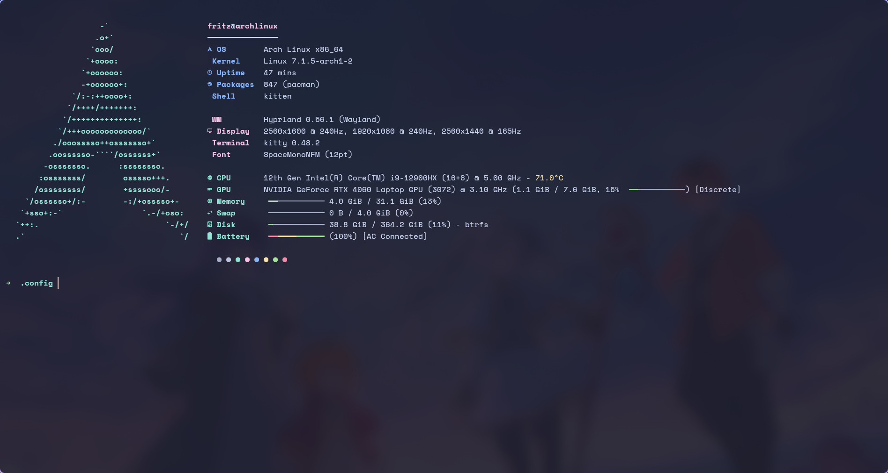
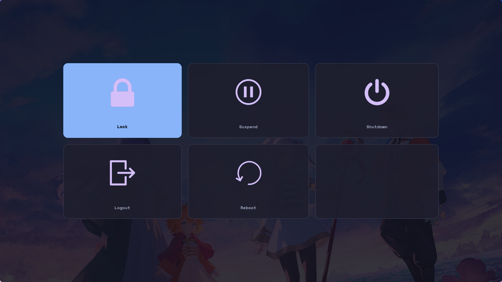

# dotfiles

> A Hyprland desktop on Arch Linux, themed from a single palette file.


---

## Contents

- [Highlights](#highlights)
- [What is in here](#what-is-in-here)
- [Theming](#theming)
- [Monitor layout](#monitor-layout)
- [Screenshots](#screenshots)
- [Installation](#installation)
- [Keybindings](#keybindings)
- [Repository layout](#repository-layout)
- [Notes](#notes)

---

## Highlights

**One command on a fresh machine.** `install.sh` reads the hardware out of
`/sys` — GPU vendor and generation, CPU, battery, sensors, backlight, radios —
and installs the driver that card actually needs, generates the two configs
that differ per machine and pulls the whole desktop up. The same clone works on
this NVIDIA laptop and on a box with integrated graphics.

**One palette, the whole desktop.** No config file has a hex value written in
the middle of it. Colors live in a single Python file, and one script generates
a color file per application and tells each one to reload. `SUPER + SHIFT + T`
repaints the bar, the terminal, the editor, the menus, the window borders, the
lock screen and every GTK app at once — across nine variants.

**Hyprland configured in Lua.** Not the classic `.conf` format. Loops, tables
and functions instead of repeated lines, split into one module per topic.

**Every file is documented in place.** These READMEs are the overview; the
comments in each file explain the reasoning behind the individual settings —
including the ones that exist to work around a specific problem.

**Wayland native throughout.** XWayland only where an application still
requires it.

## What is in here

| Role | Program | Config |
|---|---|---|
| Compositor | Hyprland | [`hypr/`](hypr/) |
| Status bar | Waybar | [`waybar/`](waybar/) |
| Terminal | kitty | [`kitty/`](kitty/) |
| Editor | Neovim | [`nvim/`](nvim/) |
| Launcher | rofi | [`rofi/`](rofi/) |
| Notifications | SwayNotificationCenter | [`swaync/`](swaync/) |
| Power menu | wlogout | [`wlogout/`](wlogout/) |
| Lock screen | hyprlock | [`hypr/hyprlock.conf`](hypr/hyprlock.conf) |
| Screenshot editor | satty | [`satty/`](satty/) |
| Resource monitor | btop | [`btop/`](btop/) |
| Terminal greeter | fastfetch | [`fastfetch/`](fastfetch/) |
| Git TUI | lazygit | [`lazygit/`](lazygit/) |
| System-wide theming | custom script | [`theme/`](theme/) |
| Login shell | zsh + oh-my-zsh | [`zsh/`](zsh/) |
| Installation | custom script | [`install/`](install/) |

## Theming


The colors live only in [`theme/palettes.py`](theme/palettes.py).
[`theme/apply.py`](theme/apply.py) turns them into whatever format each program
expects:

```
palettes.py  ──apply.py──┬─→ waybar/colors.css        (@import)
                         ├─→ swaync/colors.css        (@import)
                         ├─→ wlogout/colors.css       (@import)
                         ├─→ rofi/colors.rasi         (@import)
                         ├─→ kitty/theme.conf         (include)
                         ├─→ hypr/conf/colors.lua     (require)
                         ├─→ btop/themes/tema.theme   (color_theme)
                         ├─→ hyprlock.conf            (between markers)
                         ├─→ satty/config.toml        (between markers)
                         ├─→ ~/.local/share/themes/   (GTK3 theme)
                         ├─→ gtk-4.0/colors.css       (libadwaita)
                         └─→ nvim theme.json          (state file)
```

The 26 color names come from Catppuccin but act as **roles**, not literal
colors: `peach` means "this theme's orange". Every generator uses the roles, so
a new palette works everywhere without touching another file.

| Variant | Style |
|---|---|
| `catppuccin-mocha` | dark · pastel *(default)* |
| `catppuccin-macchiato` | dark · soft pastel |
| `catppuccin-latte` | light · pastel |
| `tokyonight-night` | dark · night blue |
| `tokyonight-day` | light · blue |
| `gruvbox-dark` | dark · earthy |
| `rose-pine` | dark · rose and pine |
| `nord` | dark · arctic blue |
| `dracula` | dark · vivid purple |

Full details in [`theme/README.md`](theme/README.md).

## Monitor layout

Three screens, each owning a workspace — set in
[`hypr/conf/monitors.lua`](hypr/conf/monitors.lua):

```
┌────────────────┐┌────────────────┐┌───────────┐
│    eDP-1       ││     DP-1       ││ HDMI-A-1  │
│  2560x1600     ││   2560x1440    ││ 1920x1080 │
│    240 Hz      ││    165 Hz      ││  240 Hz   │
│  workspace 1   ││  workspace 2   ││    ws 3   │
└────────────────┘└────────────────┘└───────────┘
     x=0              x=2560           x=5120
```

Without an explicit rule, Hyprland hands out workspaces in the order it detects
the outputs, not in the order the screens sit on the desk — which is why these
three are pinned. Workspaces 4 to 10 are deliberately left free and open
wherever focus happens to be.

## Screenshots

| | |
|---|---|
| **Waybar** — floating islands, hover drawers |  |

<table>
<tr>
<td width="50%"><br><sub><b>Neovim</b></sub></td>
<td width="50%"><br><sub><b>btop</b></sub></td>
</tr>
<tr>
<td><br><sub><b>rofi</b></sub></td>
<td><br><sub><b>SwayNotificationCenter</b></sub></td>
</tr>
<tr>
<td><br><sub><b>fastfetch</b></sub></td>
<td><br><sub><b>wlogout</b></sub></td>
</tr>
</table>

## Installation

> These are personal dotfiles, and the installer touches `/etc` on an NVIDIA
> machine. Read [`install/README.md`](install/README.md) before running it —
> or run it with `--dry-run` first, which prints every command and every
> generated file without changing anything.

```sh
git clone https://github.com/dev-fritz/.config.git ~/dotfiles
~/dotfiles/install.sh
```

That is the whole thing on a freshly formatted Arch: the script moves the
repository into `~/.config` (backing up whatever was there), installs the
packages, picks the graphics driver from the card it finds, writes the two
machine-specific config files, links the shell config, enables the services and
generates the colors.

```sh
./install.sh --detect      # what it thinks this machine is, then exit
./install.sh --dry-run     # a full run that changes nothing
./install.sh --yes         # unattended
./install.sh --help        # every option
```

### What adapts to the machine

Nothing about the hardware is written down in this repository. It is read from
`/sys` at install time:

| Detected | What changes |
|---|---|
| GPU vendor and generation | `nvidia-open-dkms`, a frozen AUR branch, Mesa for AMD/Intel, or software rendering — plus the matching `LIBVA_DRIVER_NAME` for the session |
| hybrid graphics | `nvidia-prime`, and a hint for rendering on the discrete card |
| CPU vendor | `intel-ucode` or `amd-ucode` |
| battery / chassis | power profiles, audio firmware, NVIDIA suspend units |
| CPU sensor, backlight | the Waybar temperature and brightness modules |
| bluetooth, wifi | the stacks and their services |
| installed kernels | headers for each, so the DKMS driver builds for all of them |
| btrfs, EFI, virtual machine | filesystem tools, boot tools, software rendering |

The two files this produces — `hypr/conf/hardware.lua` and
`waybar/hardware.jsonc` — are gitignored, like the generated colors: they
describe the computer, not the configuration.

```sh
./install.sh --only=hardware    # regenerate them after a hardware change
```

### Doing it by hand

The package lists are in [`install/pkg/`](install/pkg/), one per group, with a
comment on each line saying what breaks without it. After installing them, the
one step nothing works without:

```sh
~/.config/theme/apply.py
```

Every config imports a generated color file that does not exist in a fresh
clone.

## Keybindings

`SUPER` is the Windows key. The full list is in
[`hypr/README.md`](hypr/README.md); these are the ones worth memorising.

| Key | Action |
|---|---|
| `SUPER + T` | terminal |
| `SUPER + B` | browser |
| `SUPER + A` | application launcher |
| `SUPER + Q` | close window |
| `SUPER + F` | fullscreen |
| `SUPER + 1..0` | switch workspace |
| `SUPER + SHIFT + 1..0` | move window to workspace |
| `SUPER + arrows` | move focus |
| `SUPER + SHIFT + arrows` | move window |
| `SUPER + R` | resize mode |
| `SUPER + P` | screenshot a region |
| `SUPER + V` | clipboard history |
| `SUPER + S` | scratchpad |
| `SUPER + SHIFT + T` | switch theme |
| `SUPER + SHIFT + W` | switch wallpaper |
| `SUPER + L` | lock the screen |
| `SUPER + X` | power menu |

## Repository layout

```
.
├── install.sh     one-command setup for a freshly formatted machine
├── install/       package lists, hardware detection and the install steps
├── hypr/          compositor, lock screen, blue-light filter, helper scripts
│   ├── conf/      one module per topic, loaded by hyprland.lua
│   └── scripts/   screenshot, clipboard, wallpaper, theme picker
├── waybar/        status bar + weather and launcher scripts
├── kitty/         terminal
├── nvim/          editor, plugins split by area
├── rofi/          launcher: behavior, layout and grid variant
├── swaync/        notification daemon and control center
├── wlogout/       power menu
├── theme/         palettes and the generator that feeds everything above
├── satty/         screenshot editor
├── btop/          resource monitor
├── fastfetch/     terminal greeter
├── lazygit/       git TUI
└── zsh/           the shell config, linked to ~/.zshrc
```

Generated files are gitignored — the color files because they are derived from
the palette, and `hypr/conf/hardware.lua` and `waybar/hardware.jsonc` because
they describe the machine rather than the configuration. See
[`.gitignore`](.gitignore).

## Notes

**Hardware-specific settings are generated, not written.** The CPU temperature
sensor, the backlight device and the GPU environment variables all differ
between machines, so they live in two files the installer writes and git
ignores: `waybar/hardware.jsonc` and `hypr/conf/hardware.lua`. Rebuild them
with `./install.sh --only=hardware`, or write them by hand — the formats are
documented in [`waybar/README.md`](waybar/README.md) and
[`hypr/README.md`](hypr/README.md).

**The monitor layout checks itself.**
[`hypr/conf/monitors.lua`](hypr/conf/monitors.lua) holds this laptop's three
screens, but each entry is applied only if that output exists and supports that
mode — read from `/sys/class/drm` while the config is parsed. On any other
machine the entries fall through to a catch-all rule instead of pinning a
resolution the screen does not have.

**Nothing locks the screen automatically.** `hyprlock` is configured and bound
to `SUPER + L`, but no idle daemon triggers it. Install `hypridle` and write a
`hypridle.conf` if you want automatic locking and suspend.
