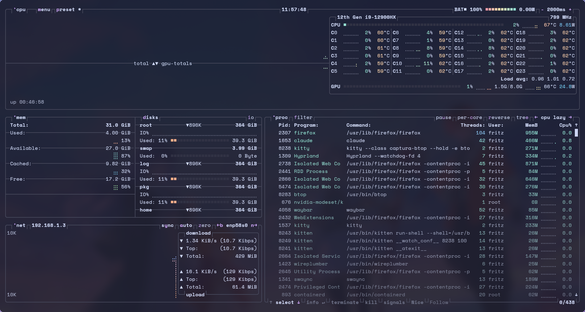

# btop

Terminal resource monitor: per-core CPU, memory, disks, network and a process
list.

## Opening it

`btop` in a terminal, or by clicking the CPU and memory modules in Waybar.

## Files

| File | What it is |
|---|---|
| [`btop.conf`](btop.conf) | the whole configuration |
| `themes/tema.theme` | **generated** by `theme/apply.py` — do not edit |

## Theming

btop follows the system theme. `apply.py` writes `themes/tema.theme` on every
variant switch, and `btop.conf` points at it with `color_theme = "tema"` — a
fixed name, so `btop.conf` never needs rewriting.

**btop reads the theme only at startup.** An open instance keeps the old colors
until you quit and reopen it.

Unlike the other applications, the generator has to **invent gradients**: btop
draws every graph and meter as a three-stop ramp and reads meaning into the
direction — a ramp ending in red says "this is filling up". So the ramps are
built from palette roles that carry the same meaning in any variant
(green→red for load, blue→purple for network) rather than from literal colors.
See `gerar_btop` in [`../theme/apply.py`](../theme/apply.py).

## Keys

| Key | Action |
|---|---|
| `Esc` or `q` | quit |
| `m` | options menu |
| `h` | help with every key |
| `+` / `-` | update interval |
| `f` | filter processes |
| `t` | toggle tree view |
| `k` | send a signal to the selected process |
| `1` `2` `3` `4` | show/hide the boxes (CPU, mem, net, proc) |

## Dependencies

| Package | For | Required |
|---|---|---|
| `btop` | the program | yes |
| `ttf-space-mono-nerd` | the block characters and the borders | yes |

To see the NVIDIA GPU (as in the screenshot above), btop needs to have been
built with GPU support — the Arch package already is, you only need the
proprietary driver installed.
