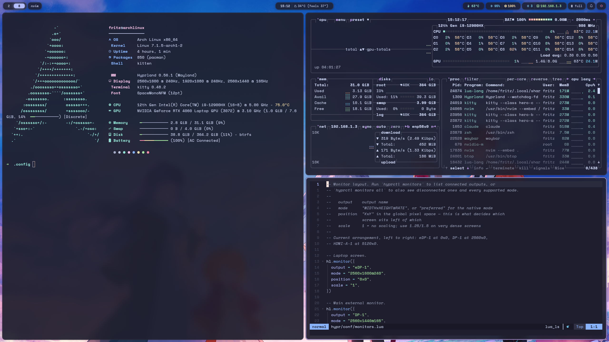

# hypr

Hyprland — the Wayland compositor that draws and arranges the windows. It is the
centre of the desktop: everything else is started by it.

The config is written in **Lua**, not the classic `.conf` format. Hyprland
gained Lua support in the 0.5x series, and the practical gain is real: loops,
tables and functions instead of repeated lines.



## Structure

[`hyprland.lua`](hyprland.lua) only declares which modules load and in what
order. Each topic lives in its own file under [`conf/`](conf/):

| File | Defines |
|---|---|
| [`conf/programs.lua`](conf/programs.lua) | default apps — the other modules read from here |
| [`conf/monitors.lua`](conf/monitors.lua) | screen positions and which workspace lives on which |
| [`conf/env.lua`](conf/env.lua) | environment variables (Wayland, Qt, GTK, newt) |
| [`conf/look.lua`](conf/look.lua) | gaps, borders, rounding, shadow, blur |
| [`conf/animations.lua`](conf/animations.lua) | easing curves and animation speeds |
| [`conf/layouts.lua`](conf/layouts.lua) | dwindle / master / scrolling and misc options |
| [`conf/input.lua`](conf/input.lua) | keyboard, mouse, touchpad, gestures |
| [`conf/keybinds.lua`](conf/keybinds.lua) | every keybinding |
| [`conf/windowrules.lua`](conf/windowrules.lua) | window, workspace and layer rules |
| [`conf/autostart.lua`](conf/autostart.lua) | what starts with the session |
| `conf/colors.lua` | **generated** by `theme/apply.py` — do not edit |
| `conf/hardware.lua` | **generated** by `../install.sh` — the GPU variables of this machine |

Outside `conf/`:

| File | What it is |
|---|---|
| [`hyprlock.conf`](hyprlock.conf) | lock screen (classic syntax, not Lua) |
| [`hyprsunset.conf`](hyprsunset.conf) | scheduled blue-light filter (classic syntax) |
| [`scripts/`](scripts/) | screenshot, clipboard, wallpaper, theme picker |

The order in `hyprland.lua` matters: `programs` comes first because `keybinds`
and `autostart` read from it, and `look` comes before `animations` because the
animations depend on `animations.enabled`.

## What adapts to the machine

Two things here are not the same on every computer, and neither is hardcoded.

**The GPU variables.** `LIBVA_DRIVER_NAME` is `nvidia` on this laptop, `iHD` on
an Intel one and `radeonsi` on AMD, and `__GLX_VENDOR_LIBRARY_NAME` only means
anything where the NVIDIA driver is installed. They live in
`conf/hardware.lua`, which [`../install.sh`](../install.sh) generates from the
PCI devices it finds, and `hyprland.lua` loads with `pcall` — a clone that has
never run the installer just starts without them.

```sh
~/.config/install.sh --only=hardware   # rewrite it after swapping a card
```

**The monitor layout.** [`conf/monitors.lua`](conf/monitors.lua) knows this
laptop's three screens, but it applies each entry only when that output is
really connected *and* really supports that mode — read from
`/sys/class/drm/card*-<output>/{status,modes}` while the config is parsed.
Anything that does not match falls through to the catch-all rule at the bottom
of the file: preferred mode, placed to the right of the others. The same file
therefore works on a single-screen desktop without being edited.

## Applying changes

```sh
hyprctl reload         # reload the config
hyprctl configerrors   # show what broke (empty means all good)
```

Two things do not pick up on reload: the variables in
[`conf/env.lua`](conf/env.lua) and the programs in
[`conf/autostart.lua`](conf/autostart.lua). Both need a logout.

> **`hyprctl dispatch` takes a Lua expression.** Since the config became Lua,
> the old form is a silent parse error:
>
> ```sh
> hyprctl dispatch workspace 3                        # broken, does nothing
> hyprctl dispatch 'hl.dsp.focus({workspace = 3})'    # correct
> ```
>
> Watch out for a second trap: a dispatcher given an **unrecognised argument**
> still returns `ok` and falls back to acting on the focused window.
> `hl.dsp.window.close({address = "0x..."})` does not close that address — it
> closes whatever is focused. The valid selector is
> `hl.dsp.focus({window = "class:foo"})`.

## Keybindings

`SUPER` is the Windows key. `hyprctl binds` lists everything currently active.

### Applications and session

| Key | Action |
|---|---|
| `SUPER + T` / `SUPER + Return` | terminal (kitty) |
| `SUPER + B` | browser (firefox) |
| `SUPER + E` | file manager (yazi in kitty) |
| `SUPER + A` | launcher (rofi) |
| `SUPER + N` | notification center |
| `SUPER + SHIFT + N` | do not disturb |
| `SUPER + L` | lock the screen |
| `SUPER + X` | power menu |
| `SUPER + SHIFT + X` | quit the session directly |

### Focused window

| Key | Action |
|---|---|
| `SUPER + Q` | close |
| `SUPER + SHIFT + Q` | force kill (cursor becomes a crosshair) |
| `SUPER + W` | toggle floating |
| `SUPER + F` | fullscreen |
| `SUPER + SHIFT + F` | maximize (keeps the bar and the gaps) |
| `SUPER + C` | center a floating window |
| `SUPER + U` | pseudo-tiling |
| `SUPER + SHIFT + U` | pin across all workspaces |
| `SUPER + J` | rotate the split |

### Focus and movement

| Key | Action |
|---|---|
| `SUPER + arrows` / `SUPER + H K` | move the focus |
| `SUPER + SHIFT + arrows` | move the window |
| `SUPER + CTRL + arrows` | resize in 40px steps |
| `SUPER + R` | resize mode (arrows or hjkl, no modifier; Esc exits) |
| `SUPER + left click` | drag the window |
| `SUPER + right click` | resize by dragging |

`SUPER + J` and `SUPER + L` are already taken by *togglesplit* and *lock*, so
"down" and "right" in vim style stay on the arrow keys.

### Workspaces

| Key | Action |
|---|---|
| `SUPER + 1..0` | switch workspace (0 is 10) |
| `SUPER + SHIFT + 1..0` | take the window along |
| `SUPER + scroll` | cycle workspaces |
| `SUPER + CTRL + , .` | the same, from the keyboard |
| `SUPER + S` | toggle the scratchpad |
| `SUPER + SHIFT + S` | send the window to the scratchpad |
| `SUPER + CTRL + SHIFT + arrows` | move the workspace to another monitor |

Workspaces 1, 2 and 3 are pinned to a monitor, so `SUPER + 1` changes which
screen has focus. That is intentional — see
[`conf/monitors.lua`](conf/monitors.lua).

### Screenshots, clipboard and theme

| Key | Action |
|---|---|
| `SUPER + P` / `Print` | screenshot a region |
| `SUPER + SHIFT + P` / `SHIFT + Print` | screenshot the focused monitor |
| `SUPER + CTRL + P` | screenshot the active window |
| `SUPER + V` | clipboard history |
| `SUPER + SHIFT + W` | switch wallpaper |
| `SUPER + SHIFT + T` | switch theme variant |

Every capture goes to the clipboard immediately and then opens satty for
annotation. A copy is saved to `~/Images/Screenshots`.

## Scripts

| Script | What it does |
|---|---|
| [`scripts/screenshot.sh`](scripts/screenshot.sh) | grab with grim, copy, open satty. Modes: `area`, `full`, `window`, `all` |
| [`scripts/clipboard.sh`](scripts/clipboard.sh) | cliphist history in a rofi menu |
| [`scripts/wallpaper.sh`](scripts/wallpaper.sh) | wallpaper picker with thumbnails |
| [`scripts/theme.sh`](scripts/theme.sh) | theme variant picker |

## Lock screen

[`hyprlock.conf`](hyprlock.conf) uses Hyprland's classic syntax, not Lua. The
background is the screen itself, blurred, and the color block between the
`# >>> CORES` and `# <<< CORES` markers is rewritten by `theme/apply.py`.

To test safely: `hyprlock --immediate-render`. If it ever hangs, switch to
another TTY with `Ctrl+Alt+F2` and run `pkill hyprlock`.

> **Nothing triggers the lock automatically.** `hyprlock` only opens with
> `SUPER + L`. For idle locking, install `hypridle` and write a
> `hypridle.conf` — it is not set up here.

## Blue-light filter

[`hyprsunset.conf`](hyprsunset.conf) defines profiles by time of day: neutral
during the day, progressively warmer in the evening. The daemon is started in
[`conf/autostart.lua`](conf/autostart.lua) behind a `command -v` guard, so it is
silently skipped when the optional package is not installed.

Manual control, with the daemon running:

```sh
hyprctl hyprsunset temperature 4000
hyprctl hyprsunset identity     # filter off
hyprctl hyprsunset profile      # back to following the schedule
```

## Dependencies

### Required

| Package | For |
|---|---|
| `hyprland` | the compositor |
| `hyprlock` | lock screen |
| `hyprpolkitagent` | password prompt for privileged actions |
| `xdg-desktop-portal-hyprland` | screen sharing, file pickers |
| `xdg-desktop-portal-gtk` | the GTK dialogs the portal uses |
| `kitty` `firefox` `yazi` `rofi-wayland` | the apps in `conf/programs.lua` |
| `waybar` `swaync` `wlogout` | bar, notifications, power menu |
| `awww` (AUR) | wallpaper daemon |
| `grim` `slurp` `satty` `wl-clipboard` | screenshot pipeline |
| `cliphist` | clipboard history |
| `wireplumber` `brightnessctl` `playerctl` | volume, brightness, media |
| `python` | the scripts parse `hyprctl` JSON with it |

### Optional

| Package | For | Without it |
|---|---|---|
| `hyprsunset` | scheduled blue-light filter | autostart skips it silently |
| `nvidia-prime` | `prime-run` on a hybrid laptop | no way to send one app to the discrete GPU |
| `hypridle` | idle lock and suspend | the screen never sleeps or locks on its own |
| `pavucontrol` | graphical mixer | Waybar falls back to `wpctl status` |
| `blueman` | Bluetooth manager | Waybar falls back to `bluetoothctl` |

Font: `ttf-space-mono-nerd`, used by hyprlock.
