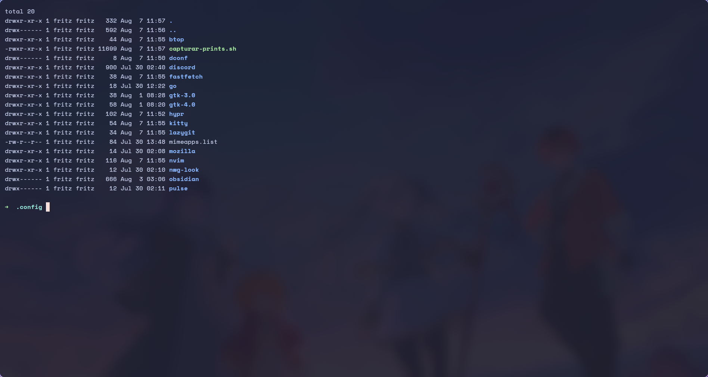

# kitty

Terminal emulator. GPU accelerated, native Wayland.

## Files

| File | What it is |
|---|---|
| [`kitty.conf`](kitty.conf) | everything that is behavior |
| `theme.conf` | **generated** by `theme/apply.py` — do not edit |

`include theme.conf` is the **last** line of `kitty.conf` on purpose: in kitty
later settings override earlier ones, so the theme has the final word on colors.

## Choices with a reason

**`SpaceMono Nerd Font Mono`, with the trailing "Mono".** That is the variant
with fixed-width icons. The variant without "Mono" draws icons double-width and
misaligns every column in Neovim, lazygit and btop.

**`background_opacity 0.92`.** Hyprland's blur only shows through something
translucent. With an opaque terminal, the blur was being computed for the bar
and the menus alone. If it hurts readability over a light wallpaper, go back to
`1.0` — the GPU cost does not change either way.

**`cursor_trail 1`.** The cursor slides to its new position instead of
teleporting, which helps not losing track of it on big jumps. It only fires on
jumps larger than 2 cells, so it does not trigger on every keystroke.

**No `fastfetch` here.** The hook lives in `~/.zshrc`, and kitty opens zsh —
duplicating it would print twice.

## Added keybindings

kitty's defaults are kept; only the additions are listed.

| Key | Action |
|---|---|
| `Ctrl+Shift+T` | new tab in the current directory |
| `Ctrl+Shift+Enter` | new window in the current directory |
| `Ctrl + = / - / 0` | font size |
| `Alt + 1..5` | jump straight to a tab |
| `Ctrl+Shift+A` then `M` / `L` | more / less opacity |
| `Ctrl+Shift+A` then `1` | fully opaque |
| `Ctrl+Shift+A` then `D` | back to the configured opacity |

The opacity shortcuts are useful for reading something behind the terminal, or
for making it opaque during a screen share.

List them all: `kitty --debug-config | grep -i '^map'`

## Applying changes

| Action | How |
|---|---|
| Reload in the current window | `Ctrl+Shift+F5` |
| Show the resolved config | `Ctrl+Shift+F6` |
| Reload every window | `killall -SIGUSR1 kitty` |

## Dependencies

| Package | For | Required |
|---|---|---|
| `kitty` | the terminal | yes |
| `ttf-space-mono-nerd` | the font and the icons | yes |
| `zsh` | the session's shell | yes |
| `fastfetch` | the greeting on open (hooked in `~/.zshrc`) | no |

Without the font, kitty falls back to the system default and every icon becomes
an empty box.
