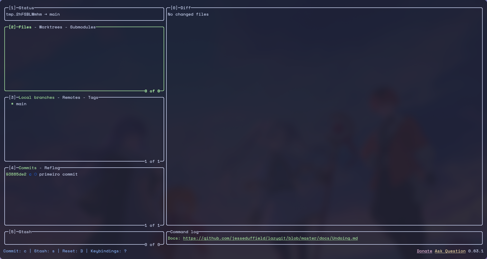

# lazygit

Terminal git client. Line-by-line staging, interactive rebase, conflict
resolution and a navigable history, all from the keyboard.



## State of this config

[`config.yml`](config.yml) is **empty** — lazygit runs entirely on its defaults.
That is deliberate: the defaults are good, and the colors already come from
kitty, which carries the active system palette.

The file exists as the starting point for when you want to change something.

## Opening it

```sh
lazygit             # in the current repository
lazygit -p PATH     # in another repository
```

It is also the git client `snacks` uses from inside Neovim.

## Essential keys

| Key | Action |
|---|---|
| `?` | help for the current context |
| `1`..`5` | switch panel (status, files, branches, commits, stash) |
| `Space` | stage / unstage the item |
| `a` | stage everything |
| `c` | commit |
| `P` / `p` | push / pull |
| `Enter` (on a file) | stage by line or by hunk |
| `q` | quit |

## Customising

The file is YAML. A common starting point:

```yaml
gui:
  nerdFontsVersion: "3"   # file icons (the font is already installed)
  showFileTree: true
git:
  paging:
    colorArg: always
```

Reference: <https://github.com/jesseduffield/lazygit/blob/master/docs/Config.md>

After editing, reopen lazygit — it reads the config only at startup.

## Dependencies

| Package | For | Required |
|---|---|---|
| `lazygit` | the program | yes |
| `git` | what it drives | yes |
| `ttf-space-mono-nerd` | icons, if you enable `nerdFontsVersion` | no |
| `delta` | nicer diffs | no |
