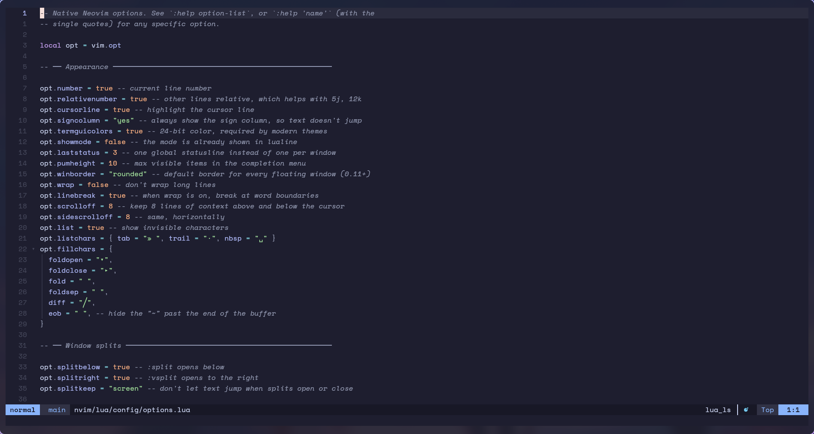

# nvim

Neovim configuration. Built from scratch — not a distribution (LazyVim, NvChad
and friends). The plugin manager is `lazy.nvim`, but every plugin was picked and
configured by hand.



## Structure

[`init.lua`](init.lua) only sets the leader keys and loads the modules in order.
The leader must be set before any plugin loads, otherwise the `<leader>x`
mappings plugins register point at the wrong key.

| File | Defines |
|---|---|
| [`lua/config/options.lua`](lua/config/options.lua) | native options (`vim.opt`) |
| [`lua/config/keymaps.lua`](lua/config/keymaps.lua) | keymaps that do not depend on a plugin |
| [`lua/config/autocmds.lua`](lua/config/autocmds.lua) | autocommands |
| [`lua/config/theme.lua`](lua/config/theme.lua) | theme switching and persistence |
| [`lua/config/lazy.lua`](lua/config/lazy.lua) | plugin manager bootstrap |
| [`lua/plugins/*.lua`](lua/plugins/) | one file per area, each returning specs |

`<leader>` is `Space`, `<localleader>` is `\`.

## Plugins, by area

| File | What it brings |
|---|---|
| `lsp.lua` | `nvim-lspconfig`, `mason` — language servers |
| `completion.lua` | `blink.cmp`, `friendly-snippets` |
| `treesitter.lua` | syntax-aware highlighting and text objects |
| `snacks.lua` | picker, explorer, statuscolumn, notifications |
| `editor.lua` | `flash`, `which-key`, `gitsigns`, `oil`, `grug-far`, `mini.*` |
| `ui.lua` | `lualine`, `bufferline`, `neo-tree`, `todo-comments` |
| `formatting.lua` | `conform` |
| `debug.lua` | `nvim-dap` plus Go and Python adapters |
| `trouble.lua` | diagnostics list |
| `terminal.lua` | `toggleterm` |
| `colorscheme.lua` | the 6 colorschemes matching the system theme variants |

## Keymaps

Vim's defaults still apply; the list below is what was added. Pressing
`<leader>` alone opens `which-key`, which shows the rest.

| Key | Action |
|---|---|
| `<leader>w` / `<leader>q` / `<leader>Q` | save / close window / quit |
| `Esc` | clear search highlight |
| `Ctrl + h j k l` | move between windows |
| `Ctrl + arrows` | resize the window |
| `<leader>-` / `<leader>\|` | horizontal / vertical split |
| `Shift + h` / `Shift + l` | previous / next buffer |
| `<leader>bb` | back to the last buffer |
| `J` / `K` *(visual)* | move the selection |
| `<` / `>` *(visual)* | indent, keeping the selection |
| `p` *(visual)* | paste without yanking the replaced text |
| `Ctrl + d` / `Ctrl + u` | half page, centered |
| `n` / `N` | next/previous match, centered |
| `]d` / `[d` | next / previous diagnostic |
| `<leader>xd` | line diagnostics in a float |
| `<leader>ut` | switch theme, with preview |
| `<leader>uB` | toggle light/dark background |

## System theme integration

Neovim **watches** `~/.local/state/nvim/theme.json`. When you switch variant
with `SUPER + SHIFT + T`, an already-open instance recolors on its own — no
command, no restart.

`<leader>ut` goes the other way: it changes only the editor's theme, with a
preview.

## Things that are not obvious

**The clipboard is declared explicitly.** Neovim's autodetection scans
`wl-copy` → `xclip` → `xsel`, and in a Wayland session with XWayland active it
can pick an X11 tool, sending `y` to the wrong clipboard. `cache_enabled = 1`
keeps `wl-copy` alive after a yank: without it the copied text disappears when
the editor closes, because on Wayland the clipboard is served by the process
that copied.

**Spell dictionaries are conditional.** Asking for a language whose `.spl` file
does not exist makes Neovim open a blocking prompt on every `.md` or commit
message, swallowing whatever you type. The `spelllang` list is built from what
is actually installed.

To write in Portuguese:

```sh
mkdir -p ~/.local/share/nvim/site/spell
curl -fL -o ~/.local/share/nvim/site/spell/pt.utf-8.spl \
     https://ftp.nluug.nl/pub/vim/runtime/spell/pt.utf-8.spl
```

Arch's `vim-spell-pt` package installs into `/usr/share/vim/`, which is not on
Neovim's runtimepath — hence the direct download.

## Dependencies

### Required

| Package | For |
|---|---|
| `neovim` | the editor (0.11+, because of `opt.winborder`) |
| `git` | `lazy.nvim` clones the plugins |
| `wl-clipboard` | copy and paste with the system |

### Strongly recommended

| Package | For | Without it |
|---|---|---|
| `ripgrep` | content search in the picker | grep-in-files is slow or missing |
| `fd` | filename search | same |
| `gcc` `make` | building treesitter parsers | syntax highlighting will not install |
| `ttf-space-mono-nerd` | icons | icons become empty boxes |

### Depending on use

`nodejs` and `npm` for LSP servers that come from npm, `python` for the Python
debug adapter, `lazygit` for the `snacks` git integration.

Run `:checkhealth` to see what is missing on this machine.

## First launch

`lazy.nvim` installs itself and downloads every plugin. Let it finish before
using the editor. Afterwards, `:Mason` shows the state of the language servers.

[`lazy-lock.json`](lazy-lock.json) pins each plugin's version and **should be
committed**: it is what guarantees the same setup on another machine.
`:Lazy update` updates and rewrites the lock.
