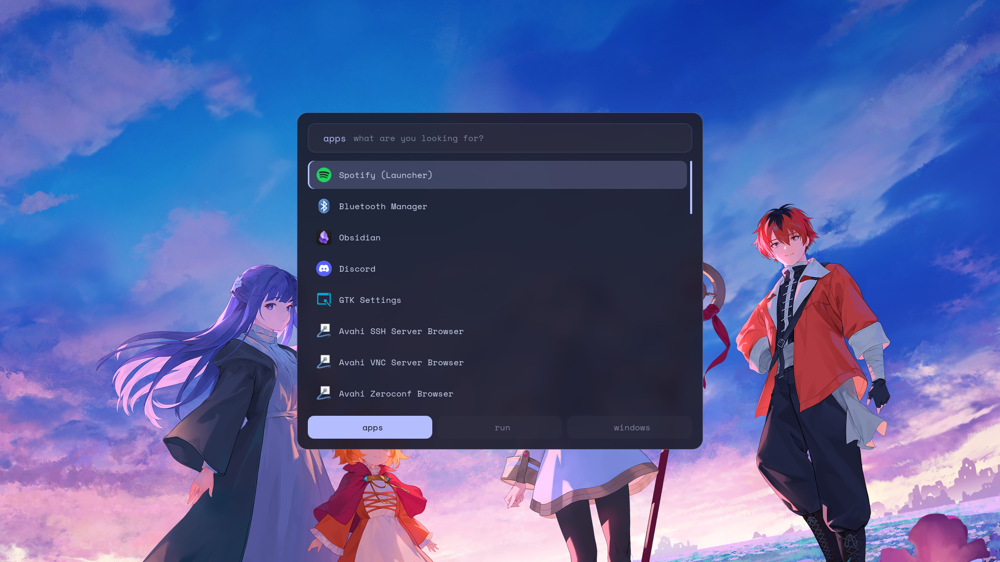

# rofi

Application launcher and general-purpose menu. This is rofi 2.0, with native
Wayland support — it does not go through XWayland.



## Where it shows up

| Key | Mode |
|---|---|
| `SUPER + A` | application launcher (`drun`) |
| `SUPER + V` | clipboard history |
| `SUPER + SHIFT + W` | wallpaper picker, with thumbnails |
| `SUPER + SHIFT + T` | theme variant picker |

The last three are scripts in [`../hypr/scripts/`](../hypr/scripts/) that use
rofi as their interface.

## Files

| File | What it is |
|---|---|
| [`config.rasi`](config.rasi) | behavior only: modes, sorting, icons |
| [`theme.rasi`](theme.rasi) | the look: sizes, spacing, borders |
| [`gallery.rasi`](gallery.rasi) | grid variation, used by the wallpaper picker |
| `colors.rasi` | **generated** by `theme/apply.py` — do not edit |

The split is deliberate: changing the look cannot break the behavior, and the
color file can be rewritten without touching the other two.

## Keys inside rofi

| Key | Action |
|---|---|
| `Ctrl + n` / `Ctrl + p` | move down / up the list |
| `Shift + ←` / `Shift + →` | switch mode (apps / run / windows) |
| `Ctrl + Tab` | the same |
| `Enter` | run |
| `Esc` | cancel |

`Ctrl + h/j/k/l` are deliberately **not** rebound: in rofi they are already
`delete-character`, `accept-entry`, `delete-to-end-of-line` and `complete`.
Overriding them makes rofi open with an error window
(`Binding 'Control+j' is already bound`).

Full list: `rofi -show drun -list-keybindings`

## Details

Sorting is by usage frequency (`sorting-method: "fzf"`), so what you open most
rises to the top. Matching is fuzzy.

`drun-display-format: "{name}"` shows only the application name, without the
`.desktop` comment — which would make every row far too long.

The icon theme is `Adwaita`, which is what exists on this machine. For nicer
icons:

```sh
sudo pacman -S papirus-icon-theme
```

then change `icon-theme` to `"Papirus-Dark"` in [`config.rasi`](config.rasi).

## Testing

```sh
rofi -show drun
```

## Dependencies

| Package | For | Required |
|---|---|---|
| `rofi` | the program — 2.0 speaks Wayland natively, the `rofi-wayland` fork is gone | yes |
| `adwaita-icon-theme` | the application icons | yes |
| `ttf-space-mono-nerd` | the font and the mode label icons | yes |
| `papirus-icon-theme` | a more complete icon set | no |
| `cliphist` | the clipboard history mode | no |
