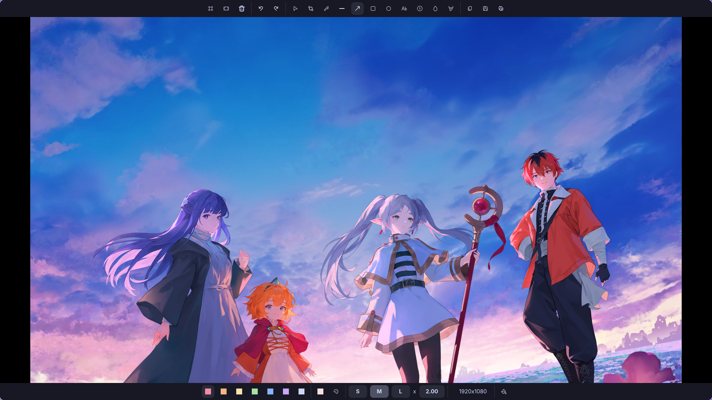

# satty

Screenshot editor. Opens automatically after every capture, to annotate before
sending.

## Where it fits

Called by [`../hypr/scripts/screenshot.sh`](../hypr/scripts/screenshot.sh),
which is what answers the screenshot keys:

| Key | Captures |
|---|---|
| `SUPER + P` / `Print` | a region |
| `SUPER + SHIFT + P` / `SHIFT + Print` | the focused monitor |
| `SUPER + CTRL + P` | the active window |

The flow is: `grim` takes the picture, the image goes to the clipboard
**immediately** (so `Ctrl+V` works even if you close the editor without doing
anything), and satty opens for annotation.

It replaced `swappy` for its cleaner interface, real undo/redo, rounded corners
on shapes and a configurable palette.

## Keys

| Key | Action |
|---|---|
| `1`..`9` or click | pick a tool from the toolbar |
| `Ctrl + Z` / `Ctrl + Y` | undo / redo |
| `Ctrl + C` | copy |
| `Ctrl + S` | save to `~/Images/Screenshots` |
| `Enter` | copy and quit |
| `Esc` | quit, leaving the clipboard alone |

## Files

Only [`config.toml`](config.toml). The `[color-palette]` block between the
`# >>> CORES` and `# <<< CORES` markers is rewritten by
[`../theme/apply.py`](../theme/apply.py) on every theme switch — TOML has no
`import`, so the swap is done by marker.

Do not edit between the markers; edit
[`../theme/palettes.py`](../theme/palettes.py).

## Choices with a reason

**`early-exit = ["copy", "save"]`** is what keeps the flow fast: capture,
annotate, `Ctrl+C`, and the window disappears on its own.

**`fullscreen = false`** because Hyprland already floats the window over the
capture — see the floating rules in
[`../hypr/conf/windowrules.lua`](../hypr/conf/windowrules.lua).

**`initial-tool = "arrow"`**: the arrow is the most used tool, pointing at
something in the image.

## Dependencies

| Package | For | Required |
|---|---|---|
| `satty` | the editor | yes |
| `grim` | taking the picture | yes |
| `slurp` | selecting the region | yes |
| `wl-clipboard` | the `wl-copy` that fills the clipboard | yes |
| `libnotify` | the script's notifications | no |

`screenshot.sh` falls back to `swappy` if satty is not installed, and notifies
you if neither exists — the capture itself is never lost, it already went to the
clipboard first.
