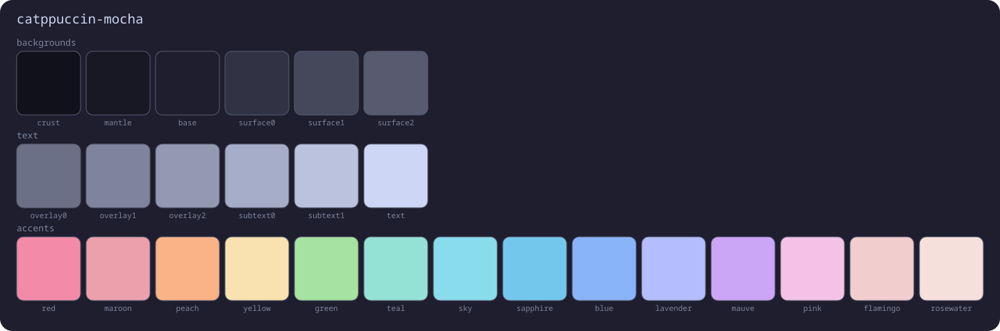

# theme

The system-wide theming engine. This is what makes `SUPER + SHIFT + T` repaint
the entire desktop at once.



## The problem it solves

A hand-built desktop usually ends up with hex values scattered across ten files:
one in the bar's CSS, another in the launcher's `.rasi`, another in the terminal
config. Switching themes becomes an afternoon of find-and-replace, and some
corner always stays the old color.

Here **no config file has a color written in the middle of it**. Colors live
only in [`palettes.py`](palettes.py), and [`apply.py`](apply.py) generates one
color file per application, which each config imports.

```
palettes.py  ──apply.py──┬─→ waybar/colors.css        (@import)
                         ├─→ swaync/colors.css        (@import)
                         ├─→ wlogout/colors.css       (@import)
                         ├─→ rofi/colors.rasi         (@import)
                         ├─→ kitty/theme.conf         (include)
                         ├─→ hypr/conf/colors.lua     (require)
                         ├─→ btop/themes/tema.theme   (color_theme)
                         ├─→ hyprlock.conf            (between markers)
                         ├─→ satty/config.toml        (between markers)
                         ├─→ ~/.local/share/themes/   (GTK3 theme)
                         ├─→ gtk-4.0/colors.css       (libadwaita)
                         └─→ nvim theme.json          (state file)
```

## Usage

```sh
./apply.py               # reapply the current variant
./apply.py gruvbox-dark  # switch variant
./apply.py --list        # list what exists
```

Or `SUPER + SHIFT + T`, which opens the picker in rofi.

## Variants

| Name | Style |
|---|---|
| `catppuccin-mocha` | dark · pastel *(default)* |
| `catppuccin-macchiato` | dark · soft pastel |
| `catppuccin-latte` | light · pastel |
| `tokyonight-night` | dark · night blue |
| `tokyonight-day` | light · blue |
| `gruvbox-dark` | dark · earthy |
| `rose-pine` | dark · rose and pine |
| `nord` | dark · arctic blue |
| `dracula` | dark · vivid purple |

## How the colors are organised

There are 26 names, taken from Catppuccin, but they work as **roles**, not as
literal colors. `peach` means "this theme's orange" and `mauve` means "its
purple". Every generator in `apply.py` uses the roles, so a new palette works
across all applications without touching anything else.

```
Backgrounds, darkest to lightest:
    crust  mantle  base  surface0  surface1  surface2
Text, faintest to strongest:
    overlay0  overlay1  overlay2  subtext0  subtext1  text
Accents:
    red  maroon  peach  yellow  green  teal  sky  sapphire  blue
    lavender  mauve  pink  flamingo  rosewater
```

## Adding a variant

1. Copy a `PALETTES` block in [`palettes.py`](palettes.py) and fill in all 26 names.
2. Register it in `IS_DARK`, `NVIM_COLORSCHEME`, `WALLHAVEN_COLOR` and `DESCRICAO`.
3. Create its wallpaper folder: `mkdir -p ~/Images/Pictures/<name>`.
4. Install the matching Neovim colorscheme in
   [`../nvim/lua/plugins/colorscheme.lua`](../nvim/lua/plugins/colorscheme.lua).

## What reloads immediately and what does not

| Immediately | Only on reopen |
|---|---|
| Waybar, swaync, Hyprland | libadwaita apps (colors; light/dark is instant) |
| kitty (SIGUSR1) | wlogout, hyprlock |
| Neovim (it watches the state file) | **btop** |
| GTK3 apps (via the theme-name change) | |

The GTK3 trick is the name: each variant generates a theme with its own name,
and it is the name **changing** that makes every open GTK3 app reread from disk.
That is why reapplying the *same* variant repaints nothing — after editing
`palettes.py`, reopen the app to see the effect.

Firefox follows the system light/dark setting as long as its own theme is set to
"System theme — auto" (`about:addons` → Themes).

## Files

| File | What it is |
|---|---|
| [`palettes.py`](palettes.py) | **the only file with hand-written hex** |
| [`apply.py`](apply.py) | generates the color files and reloads each app |
| [`baixar-wallpapers.py`](baixar-wallpapers.py) | fetches wallpapers from wallhaven by the variant's dominant color |
| `current` | the active variant (state, not config) |

## Dependencies

| Package | For | Required |
|---|---|---|
| `python` | both scripts | yes |
| `glib2` | the `gsettings` call that notifies GTK apps | yes |
| `rofi-wayland` | the `SUPER + SHIFT + T` picker | no |
| `librsvg` | rendering the palette card above | no |

`apply.py` does not break when an application is missing: every reload goes
through a helper that swallows the "command not found" error.
